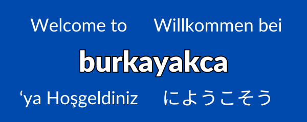

</img>

## 🖥️ About Me  

- 🌟I’m **Ali Burkay**, an aspiring developer passionate about creating impactful software solutions.  
- 💻 **Full-Stack Developer in Training**: Currently enhancing my skills in Python and web development.  
- 🌱 Continuously learning, experimenting, and building projects.  

---

## 🔧 Featured Projects  

Here’s a selection of what I’m working on:  

- 🎮 **[Python-Say-tahmin-oyunu](https://github.com/burkayakca/Python-Say-tahmin-oyunu)**  
  A fun and interactive number guessing game built with Python.*

- 📚 **[LibraryManagement](https://github.com/burkayakca/LibraryManagement)**  
  A Python-based program to streamline library management.**

- 🌐 **[burkayakca.github.io](https://github.com/burkayakca/burkayakca.github.io)**  
  My personal portfolio website – currently under construction! 

- 🖼️ **[VisualComparisonSliderCreator](https://github.com/burkayakca/VisualComparisonSliderCreator)**  
  A Python tool to create intuitive sliders for visual comparisons.*  

* These repos provide User interfaces in <bold>Turkish</bold> but can be easily implemented into any language with the help of AI.

    

**Turkish UI. English documentation included

---

## 📊 Contributions  

- **112 contributions this year** and growing!  
- Actively exploring new technologies and contributing to open-source projects.  

---

## 🔗 Connect with Me  

- 💬 Message me directly here on GitHub.  
- 👥 Follow my work to stay updated with my projects.  

---

Thank you for visiting my profile! 🎉 Let's create, learn, and grow together.  
<!---
burkayakca/burkayakca is a ✨ special ✨ repository because its `README.md` (this file) appears on your GitHub profile.
You can click the Preview link to take a look at your changes.
--->
